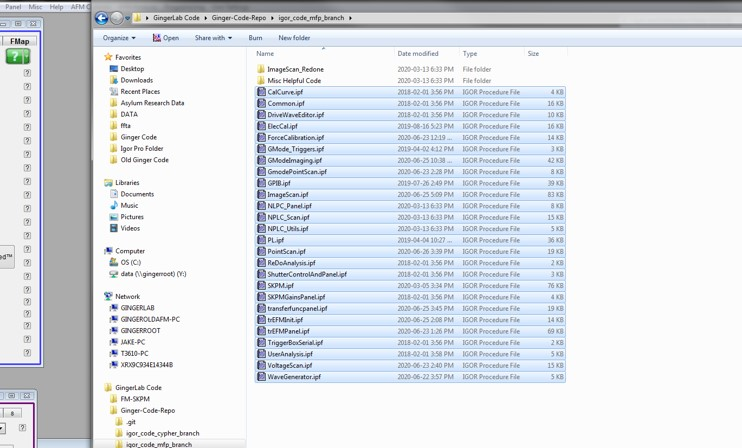
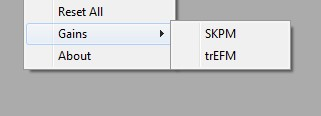

trEFM Igor Setup Guide
======================
Rajiv Giridharagopal

1.	Navigate to the "GingerLab Code/Ginger-Code-Repo/igor_code_mfp_branch" directory.
	
	|directory|

2.	Highlight all files in the directory, then drag and drop into Igor.

	|highlight|

3. 	Press compile.
	
	|compile|

	After that, a "trEFM" menu will appear.

	|menu|

4.	These contain several panels.

	|panels|

	* **trEFM panel**: The main panel. You always need to run this.
	* **SKPM panel**: Only for FM-Kelvin probe.
	* **PL panel**: For Photoluminescence.
	* **NLPC panel**: For Justin's nonlocal photocurrent measurement.
	* **TF panel**: For Raj's transfer function measurement panel.
	* **Reset all**: Resets all the parameters.

	|gains|

	* These contain the gains needed for these techniques.
	* We never need to edit the trEFM ones these days.
	* SKPM ones you should open as you WILL need to edit those for FM-SKPM

5.	This is the trEFM panel.
	
	|trefmpanel|

	* **A**: Move to whichever coordinates you input.
	* **B**: Displays the current cantilever XY position.
	* **C**: Grabs the X and Y offset from the Master Panel. You'll need to click this several times.
	* **D**: These set up the cantilever for FM modes.

	    * Grab tune: Finds the drive amplitude required for the cantilever to oscillate at 0.3 V (this is effectively like hitting 
	      Autotune with a Target Amplitude of 0.3, but our code does its own thing)
	    * Voltage Scan: Measures the frequency shift parabola. If the system is working, you’ll get a nice parabola from -10 V to +10 
	      V. For very sensitive perovskites, you can set this to +/- 5 V instead.
	      If you see noise, STOP! Something is not connected correctly.

	* **E**: Height scan isn't used.
	* **F**: These control the various signals being sent out.

	  	* Trigger comes out of Output 0 on the ARC LED comes out of Output 1 on the ARC Voltage comes out of Output 2 on the ARC.
	   	* LED is used to trigger the Gage card and, as evidenced by the name, turn on an LED or laser. Primarily it’s the trigger 
	   	  for the Gage card.
	   	* Trigger, ironically, is not actually a trigger signal. It isn’t actually that important. It exists for historical reasons and 
	   	  some esoteric use cases. The output is mapped differently in GKPFM.
	   	* Voltage is what is being sent to the tip during EFM mode. The output on the ARC is for diagnostic purposes.
	   	* The -->Recom button doesn’t do anything any more. It works on the Cypher specifically (sometimes) but is used when you 
	   	  want to trigger the system on the falling edge instead of a rising edge. This is a pretty rare use case 

.. |directory| image:: trefm_setup_images/directory.jpg

.. |compile| image:: trefm_setup_images/compile.jpg

.. |menu| image:: trefm_setup_images/menu.jpg

.. |panels| image:: trefm_setup_images/panels.jpg

.. |trefmpanel| image:: trefm_setup_images/trefmpanel.jpg
